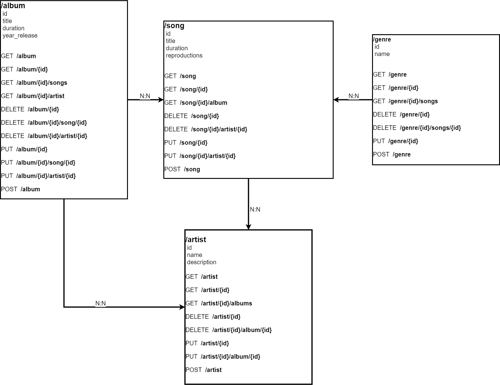
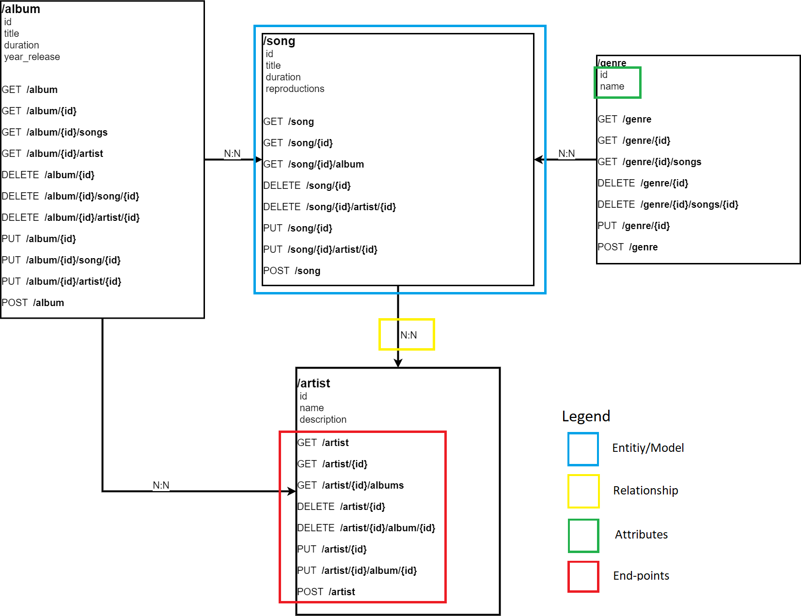
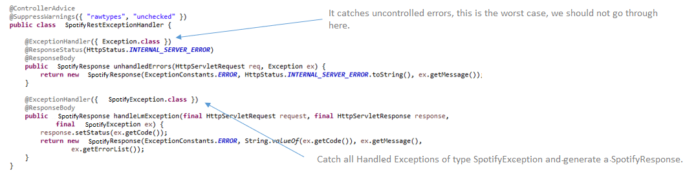

# Netflix:

- **Reference documentation:**
    - [Spring Boot](#spring-boot)
    - [Hibernate](#hibernate)
    - [Best Practices Restful](#best-practices-restful)
    - [Others](#others)
- **Project example:**
    - [Spotify](#spotify)
      - [Java 11](#java-11)
      - [FlyWay](#flyway)
      - [MapStruct](#mapstruct)
    - [Archetype](#archetype)
    - [Data base](#data-base)
    - [Endpoints](#endpoints)

# Reference documentation

## Spring Boot

## Hibernate

## Best Practices Restful

## Others

# Project example

## Spotify

Spotify is a test repository that helps to start and implement a 
test project with Spring Boot.

So what we are going to see are the first steps in Spring Boot:

D4I Team - NTT Data

**CONTENT**
1. [What is Spring Boot?](#what-is_Spring-Boot?)
2. [Exercise presentation](#exercise-presentation)
   1. [API model definition](#api-model-definition)
   2. [API creation](#api-creation)
      1. [BD, Entity, RestModel, Controller, Service, Repository, End-points)](#api-db-etc)
   3. [Other common classes](#other-common-classes)

### What is Spring Boot?
Spring Boot is a tool that was created in order to further simplify the development of applications based on the already
popular Spring Core framework. Spring Boot seeks that the developer only focus on the development of the solution, 
completely forgetting about the complex configuration that Spring Core currently has to work.

### Exercise presentation
In this short SpringBoot exercise we are going to create an API similar to Spotify. Specifically, initially the client 
asks us to show the lists of all songs, albums, artists and genres.

Along with the PO, the following User Stories or US (User Stories) are detailed:

*Songs*
- As a user I want to be able to consult the list of songs 
- As a user I want to be able to consult the detail file of a song 
- As a user I want to be able to consult the album of the song by the song id
- As a user I want to be able to delete a song 
- As a user I want to be able to delete an artist from a song by id
- As a user I want to be able to update a song 
- As a user I want to be able to add an artist to the song by artist id
- As a user I want to be able to create a new song

*Albums*
- As a user I want to be able to consult the list of albums
- As a user I want to be able to consult the detail file of an album
- As a user I want to be able to consult the songs of an album by id
- As a user I want to be able to consult the artists of an album by id
- As a user I want to be able to delete album by id
- As a user I want to be able to delete a song from the album
- As a user I want to be able to delete an artist from the album
- As a user I want to be able to modify an album
- As a user I want to be able to add a song to an album by the song
- As a user I want to be able to add an artist to an album by artist
- As a user I want to be able to create new album

*Artists*
- As a user I want to be able to consult the list of artists
- As a user I want to be able to consult the detail file of an artist
- As a user I want to be able to consult the list of albums by the artist
- As a user I want to be able to delete an artist
- As a user I want to be able to delete an album from the artist
- As a user I want to be able to modify an artist
- As a user I want to be able to insert an album into the artist by its album
- As a user I want to be able to create a new artist

*Genres*
- As a user I want to be able to consult the list of genres
- As a user I want to be able to consult the detail file of a genre
- As a user I want to be able to consult the list of songs by one genre
- As a user I want to be able to delete genre
- As a user I want to be able to delete a song by its genre
- As a user I want to be able to modify a genre
- As a user I want to be able to create a new genre

### API model definition

***Songs API:***

### Other common classes

***Exceptions***

Exceptions is the way to control errors that may occur during runtime, therefore, to maintain a good user experience, 
all possible errors must be controlled in order to leave traceability to correct them and display friendly messages and
intuitive both to the platforms that are integrated and to the end user.
Springboot makes this task easy, as it is capable of catching all the exceptions that are thrown in the controllers and
the layers below it using a Handler.

### Java 11

### FlyWay

### MapStruct

## Archetype

When starting a project first you have to build the structure: the archetype.
As we know from the description, in Spotify you have different objects that interact between them: songs, albums, artists, genres and awards.

That means that we need an entity for each one of them. There we are going to define it's attributes, getters and setters.

--> imagen entity definida (explicación)

Not only that, we also need other classes such as a repository in order to be able to communicate with the tables defined in our DB, a rest structure for the respose, controller and service (and it's implementation) to define the methods so then the user can interact with our programm. One of the previous one for each object that participates in the programm, as a general rule.

--> imagenes de definición + explicación

There are another important classes that are involved when coding: configuration, exceptions, responses, utils... These are not related with each object but with the general functionality of the code. Here you have some examples:

--> ejemplos de las clases con explicación de que es (no todas)

Remember that when programming is not just coding. We need some testing in each controller/service to verify that everything works how it's supposed to do and that's why we need testing classes:

--> imagen de un test (explicación)

As you know, you can use our archetype builder generator that's helps with the structure. In this [URL](https://gitlab.com/bootcamp-2.0/archetype/-/blob/main/Archetype.md) you can access to some info of how you can use it.

## Data base

## Endpoints

