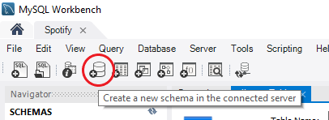
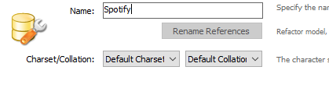
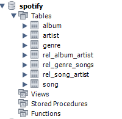

# Netflix:

- **Reference documentation:**
    - [Spring Boot](#spring-boot)
    - [Hibernate](#hibernate)
    - [Best Practices Restful](#best-practices-restful)
    - [Others](#others)
- **Project example:**
    - [Spotify](#spotify)
        - [Java 11](#java-11)
        - [FlyWay](#flyway)
        - [MapStruct](#mapstruct)
    - [Archetype](#archetype)
    - [Data base](#data-base)
    - [Endpoints](#endpoints)

# Reference documentation

## Spring Boot

## Hibernate

## Best Practices Restful

## Others

# Project example

## Spotify

### Java 11

### FlyWay

### MapStruct

## Archetype

## Data base

For this project, we have chosen to use a database in MySQL. To start with the database you need to have MySQL
installed, and you can access the explanation on
this [URL](https://gitlab.com/bootcamp-2.0/welcome-pack/-/blob/development/WelcomePack.md#sql-client)

At first, after the installation, you need to create a scheme:



And set the name. On this case the name it is "Spotify"



When you have created the schema, the next step it is starts to create the different tables.

### Table creation scripts

Album:

```
CREATE TABLE `spotify`.`album` (
  `id` INT NOT NULL AUTO_INCREMENT,
  `title` VARCHAR(250) NULL,
  `duration` DOUBLE NULL,
  `year_release` INT NULL,
  PRIMARY KEY (`id`));
```

Song:

```
CREATE TABLE `spotify`.`song` (
  `id` INT NOT NULL AUTO_INCREMENT,
  `title` VARCHAR(250) NULL,
  `duration` DOUBLE NULL,
  `reproductions` INT NULL,
  `album_ref` INT NULL,
  PRIMARY KEY (`id`),
  INDEX `album_fk_idx` (`album_ref` ASC) VISIBLE,
  CONSTRAINT `album_fk`
    FOREIGN KEY (`album_ref`)
    REFERENCES `spotify`.`album` (`id`)
    ON DELETE SET NULL
    ON UPDATE CASCADE);
```

Artist:

```
CREATE TABLE `spotify`.`artist` (
`id` INT NOT NULL AUTO_INCREMENT,
`name` VARCHAR(250) NULL,
`description` VARCHAR(800) NULL,
PRIMARY KEY (`id`));
```

Genre:

```
CREATE TABLE `spotify`.`genre` (
  `id` INT NOT NULL AUTO_INCREMENT,
  `name` VARCHAR(90) NULL,
  PRIMARY KEY (`id`));
```

And after you have create the different tables in order, the next step it is create the diferent relations many to many
or one to many.

Relation genre-song

```
CREATE TABLE `spotify`.`rel_genre_songs` (
  `id_genre` INT NOT NULL,
  `id_song` INT NOT NULL,
  PRIMARY KEY (`id_genre`, `id_song`),
  INDEX `fk_rel_song_idx` (`id_song` ASC) VISIBLE,
  CONSTRAINT `fk_rel_genre`
    FOREIGN KEY (`id_genre`)
    REFERENCES `spotify`.`genre` (`id`)
    ON DELETE NO ACTION
    ON UPDATE CASCADE,
  CONSTRAINT `fk_rel_song`
    FOREIGN KEY (`id_song`)
    REFERENCES `spotify`.`song` (`id`)
    ON DELETE NO ACTION
    ON UPDATE CASCADE);
```

Relation album-artist

```
CREATE TABLE `spotify`.`rel_album_artist` (
  `id_album` INT NOT NULL,
  `id_artist` INT NOT NULL,
  PRIMARY KEY (`id_album`, `id_artist`),
  INDEX `fk_rel_albumartist_artist_idx` (`id_artist` ASC) VISIBLE,
  CONSTRAINT `fk_rel_albumartist_album`
    FOREIGN KEY (`id_album`)
    REFERENCES `spotify`.`album` (`id`)
    ON DELETE NO ACTION
    ON UPDATE CASCADE,
  CONSTRAINT `fk_rel_albumartist_artist`
    FOREIGN KEY (`id_artist`)
    REFERENCES `spotify`.`artist` (`id`)
    ON DELETE NO ACTION
    ON UPDATE CASCADE);
```

Relation album-song

```
CREATE TABLE `spotify`.`rel_album_song` (
  `id_album` INT NOT NULL,
  `id_song` INT NOT NULL,
  PRIMARY KEY (`id_album`, `id_song`),
  INDEX `fk_rel_albumsong_song_idx` (`id_song` ASC) VISIBLE,
  CONSTRAINT `fk_rel_albumsong_album`
    FOREIGN KEY (`id_album`)
    REFERENCES `spotify`.`album` (`id`)
    ON DELETE NO ACTION
    ON UPDATE CASCADE,
  CONSTRAINT `fk_rel_albumsong_song`
    FOREIGN KEY (`id_song`)
    REFERENCES `spotify`.`song` (`id`)
    ON DELETE NO ACTION
    ON UPDATE CASCADE);
```

Relation song_artist

```
CREATE TABLE `spotify`.`rel_song_artist` (
  `id_song` INT NOT NULL,
  `id_artist` INT NOT NULL,
  PRIMARY KEY (`id_song`, `id_artist`),
  INDEX `fk_rel_songartist_artist_idx` (`id_artist` ASC) VISIBLE,
  CONSTRAINT `fk_rel_songartist_song`
    FOREIGN KEY (`id_song`)
    REFERENCES `spotify`.`song` (`id`)
    ON DELETE NO ACTION
    ON UPDATE CASCADE,
  CONSTRAINT `fk_rel_songartist_artist`
    FOREIGN KEY (`id_artist`)
    REFERENCES `spotify`.`artist` (`id`)
    ON DELETE NO ACTION
    ON UPDATE CASCADE);
```

After creating all tables, you should see something like this:



### Inserts

```
INSERT INTO `spotify`.`artist` (`name`, `description`) VALUES ('Drake', 'Canadian rapper and vocalist Drake sustained a high-level commercial presence shortly after he hit the scene in 2006, whether with his own chart-topping releases or a long string of guest appearances on hits by the likes of Lil Wayne, Rihanna , and A$AP Rocky .');
INSERT INTO `spotify`.`artist` (`name`, `description`) VALUES ('Giggs', 'Giggs is a British rapper who made his critically acclaimed solo album debut in 2008 with Walk in da Park.');
INSERT INTO `spotify`.`artist` (`name`, `description`) VALUES ('Black Coffee', 'South African house music DJ and producer Black Coffee built his career gradually over nearly two decades, riding the growing global interest in his home country\'s burgeoning dance music scene and eventually becoming arguably the biggest DJ in Africa.');
INSERT INTO `spotify`.`artist` (`name`, `description`) VALUES ('Jorja Smith', 'Jorja Smith is an English R & B singer/songwriter whose soulful, jazz-tinged cadence, heartfelt lyrics, and retro sound invoke names like Lauryn Hill, Alicia Keys, Rihanna, and Amy Winehouse, the latter of whom the Walsall-based artist cites as her biggest influence.');
INSERT INTO `spotify`.`artist` (`name`, `description`) VALUES ('Sampha', 'In February 2017, Sampha released his debut album Process via Young Turks. The album - an achingly beautiful, emotionally raw and musically adventurous body of work co-produced by Sampha and Rodaidh McDonald - was the culmination of years of work for the singer, songwriter and producer who hails from South London. ');

INSERT INTO `spotify`.`album` (`title`, `duration`, `year_release`) VALUES ('More Life', '1.21', '2017');
INSERT INTO `spotify`.`rel_album_artist` (`id_album`, `id_artist`) VALUES ('1', '1');

INSERT INTO `spotify`.`song` (`title`, `duration`, `reproductions`, `album_ref`) VALUES ('Free smoke', '3.38', '170300000', '1');
INSERT INTO `spotify`.`song` (`title`, `duration`, `reproductions`, `album_ref`) VALUES ('No Long Talk', '2.29', '116090000', '1');
INSERT INTO `spotify`.`song` (`title`, `duration`, `reproductions`, `album_ref`) VALUES ('Passionfruit', '4.58', '1009000000', '1');
INSERT INTO `spotify`.`song` (`title`, `duration`, `reproductions`, `album_ref`) VALUES ('Jorja Interlude', '1.47', '102042000', '1');
INSERT INTO `spotify`.`song` (`title`, `duration`, `reproductions`, `album_ref`) VALUES ('Get It Together', '4.10', '192403000', '1');
INSERT INTO `spotify`.`song` (`title`, `duration`, `reproductions`, `album_ref`) VALUES ('Madiba Riddim', '3.25', '192403000', '1');
INSERT INTO `spotify`.`song` (`title`, `duration`, `reproductions`, `album_ref`) VALUES ('Blem', '3.25', '129680000', '1');
INSERT INTO `spotify`.`song` (`title`, `duration`, `reproductions`, `album_ref`) VALUES ('4422', '3.06', '120230000', '1');
INSERT INTO `spotify`.`song` (`title`, `duration`, `reproductions`, `album_ref`) VALUES ('Gyalchester', '3.09', '306130000', '1');
INSERT INTO `spotify`.`song` (`title`, `duration`, `reproductions`, `album_ref`) VALUES ('Skepta Interlude', '2.23', '75900000', '1');
INSERT INTO `spotify`.`song` (`title`, `duration`, `reproductions`, `album_ref`) VALUES ('Portland', '3.56', '468400000', '1');
INSERT INTO `spotify`.`song` (`title`, `duration`, `reproductions`, `album_ref`) VALUES ('Sacrifices', '5.07', '128530000', '1');
INSERT INTO `spotify`.`song` (`title`, `duration`, `reproductions`, `album_ref`) VALUES ('Nothings Into Somethings', '2.33', '75730000', '1');
INSERT INTO `spotify`.`song` (`title`, `duration`, `reproductions`, `album_ref`) VALUES ('Teenage Fever', '3.39', '352195000', '1');
INSERT INTO `spotify`.`song` (`title`, `duration`, `reproductions`, `album_ref`) VALUES ('KMT', '2.42', '145600000', '1');
INSERT INTO `spotify`.`song` (`title`, `duration`, `reproductions`, `album_ref`) VALUES ('Lose You', '5.05', '70350000', '1');
INSERT INTO `spotify`.`song` (`title`, `duration`, `reproductions`, `album_ref`) VALUES ('Can\'t Have Everything', '3.48', '83960000', '1');
INSERT INTO `spotify`.`song` (`title`, `duration`, `reproductions`, `album_ref`) VALUES ('Glow', '3.26', '70028000', '1');
INSERT INTO `spotify`.`song` (`title`, `duration`, `reproductions`, `album_ref`) VALUES ('Since Way Back', '6.08', '68760311', '1');
INSERT INTO `spotify`.`song` (`title`, `duration`, `reproductions`, `album_ref`) VALUES ('Fake Love', '3.30', '818115000', '1');
INSERT INTO `spotify`.`song` (`title`, `duration`, `reproductions`, `album_ref`) VALUES ('Ice Melts', '4.10', '103700000', '1');
INSERT INTO `spotify`.`song` (`title`, `duration`, `reproductions`, `album_ref`) VALUES ('Do Not Disturb', '4.43', '260410000', '1');


```

## Endpoints

