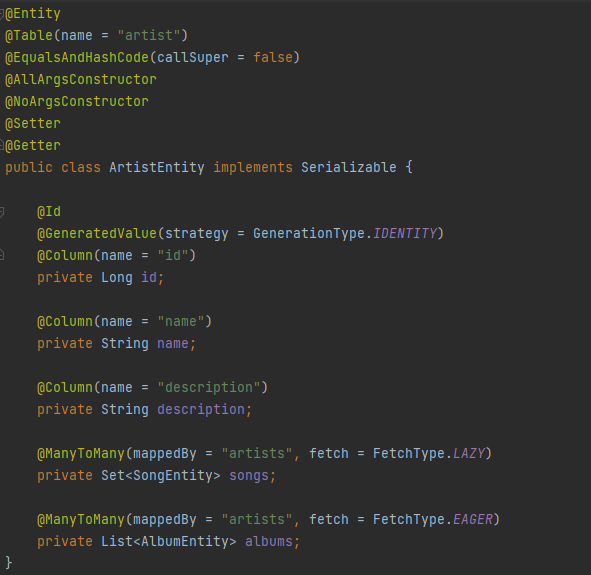
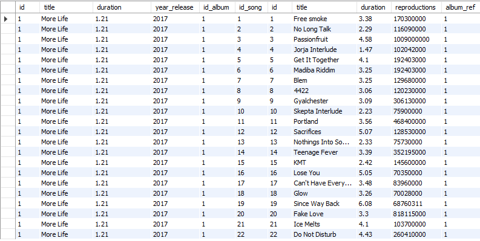
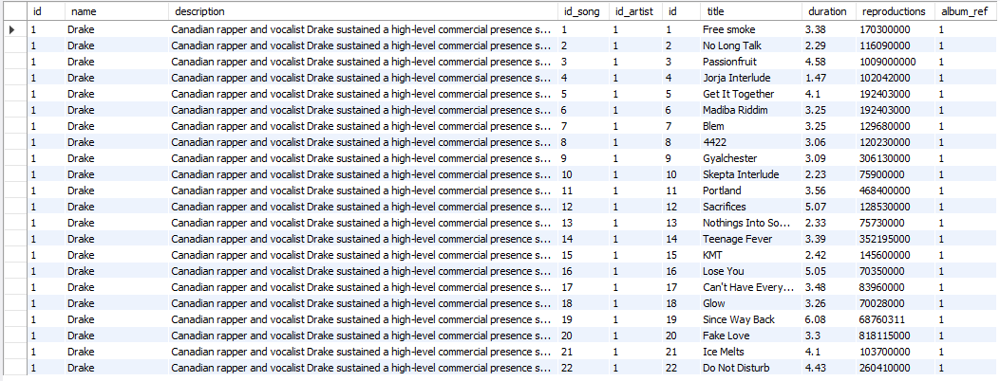

# Spotify:

- **Project example:**
    - [Spotify](#spotify)
        - [Java 11](#java-11)
        - [FlyWay](#flyway)
        - [MapStruct](#mapstruct)
    - [Archetype](#archetype)
    - [Data base](#data-base)
    - [Endpoints](#endpoints)
    

# Project example

## Spotify


Spotify is a test repository that helps to start and implement a 
test project with Spring Boot.

So what we are going to see are the first steps in Spring Boot:


D4I Team - NTT Data

**CONTENT**
1. [What is Spring Boot?](#what-is_Spring-Boot?)
2. [Exercise presentation](#exercise-presentation)
   1. [API model definition](#api-model-definition)
   2. [Other common classes](#other-common-classes)

### What is Spring Boot?
Spring Boot is a tool that was created in order to further simplify the development of applications based on the already
popular Spring Core framework. Spring Boot seeks that the developer only focus on the development of the solution, 
completely forgetting about the complex configuration that Spring Core currently has to work.

### Exercise presentation
In this short SpringBoot exercise we are going to create an API similar to Spotify. Specifically, initially the client 
asks us to show the lists of all songs, albums, artists and genres.

Along with the PO, the following User Stories or US (User Stories) are detailed:

*Songs*
- As a user I want to be able to consult the list of songs 
- As a user I want to be able to consult the detail file of a song 
- As a user I want to be able to consult the album of the song by the song id
- As a user I want to be able to delete a song 
- As a user I want to be able to delete an artist from a song by id
- As a user I want to be able to update a song 
- As a user I want to be able to add an artist to the song by artist id
- As a user I want to be able to create a new song

*Albums*
- As a user I want to be able to consult the list of albums
- As a user I want to be able to consult the detail file of an album
- As a user I want to be able to consult the songs of an album by id
- As a user I want to be able to consult the artists of an album by id
- As a user I want to be able to delete album by id
- As a user I want to be able to delete a song from the album
- As a user I want to be able to delete an artist from the album
- As a user I want to be able to modify an album
- As a user I want to be able to add a song to an album by the song
- As a user I want to be able to add an artist to an album by artist
- As a user I want to be able to create new album

*Artists*
- As a user I want to be able to consult the list of artists
- As a user I want to be able to consult the detail file of an artist
- As a user I want to be able to consult the list of albums by the artist
- As a user I want to be able to delete an artist
- As a user I want to be able to delete an album from the artist
- As a user I want to be able to modify an artist
- As a user I want to be able to insert an album into the artist by its album
- As a user I want to be able to create a new artist

*Genres*
- As a user I want to be able to consult the list of genres
- As a user I want to be able to consult the detail file of a genre
- As a user I want to be able to consult the list of songs by one genre
- As a user I want to be able to delete genre
- As a user I want to be able to delete a song by its genre
- As a user I want to be able to modify a genre
- As a user I want to be able to create a new genre

### API model definition

***Songs API:***


### Other common classes

***Exceptions***

Exceptions is the way to control errors that may occur during runtime, therefore, to maintain a good user experience, 
all possible errors must be controlled in order to leave traceability to correct them and display friendly messages and
intuitive both to the platforms that are integrated and to the end user.
Springboot makes this task easy, as it is capable of catching all the exceptions that are thrown in the controllers and
the layers below it using a Handler.


### Java 11

The Java version used for the training project is Java 11. With this, you can work 
without any problem, but if you want to use another version*, you can change the JDK 
you want at this link, for exemple [Java 8 JDK](https://www.oracle.com/java/technologies/downloads/#java8). 

In addition, it has a step-by-step installation guide for the JDK in case the IDE 
used does not download it automatically. In our case, 
the step-by-step installation link of Java 11 is added below [Java 11 Installation Guide](https://docs.oracle.com/en/java/javase/11/install/overview-jdk-installation.html#GUID-8677A77F-231A-40F7-98B9-1FD0B48C346A).

*\*Note that we must remember to change the pom.xml if using another version of Java. 
It is also useful to check the version to avoid errors.*

### FlyWay

Flyway updates a database from one version to the next using migrations. We can write 
migrations either in SQL with database-specific syntax, or in Java for advanced database 
transformations.

There is a plugin in Maven that allows us to use FlyWay, to install it we will
to add the following plugin definition to our pom.xml:

```java
<plugin>
    <groupId>org.flywaydb</groupId>
    <artifactId>flyway-maven-plugin</artifactId>
    <version>8.0.0</version> 
</plugin>
```

This plugin can be configured by adding the tag: <configuration> in our plugin section.
```java
<plugin>
    <groupId>org.flywaydb</groupId>
    <artifactId>flyway-maven-plugin</artifactId>
    <version>8.0.0</version>
    <configuration>
        <user>databaseUser</user>
        <password>databasePassword</password>
        <schemas>
            <schema>schemaName</schema>
        </schemas>
        ...
    </configuration>
</plugin>
```

To find out more ways to configure the plugin, refer to the following reference link.
And to see an example of migration see section *3* of the same guide.
[Database Migrations with Flyway](https://www.baeldung.com/database-migrations-with-flyway)


### MapStruct

"*MapStruct is a code generator that greatly simplifies the implementation of 
mappings between Java bean types based on a convention over configuration approach [...]
As shown on your web page, let's say we have a class that represents cars (for 
example, a JPA entity) and an accompanying data transfer object (DTO).*

*Both types are quite similar, only the seat count attributes have different names 
and the type attribute is a special enum type in the Car class but is a plain 
string in the DTO.*"

See full example: [MapStruct official Web](https://mapstruct.org/)

To configure MapStruct in our Spring project, follow the next tutorial (Apache Maven Section):
[MapStruct Spring Reference Guide](https://mapstruct.org/documentation/spring-extensions/reference/html/)

**Main annotations**

We will see the main annotations that form MapStruct.

```java
@Mapper
public interface SpotifyMapper {
    //Code
}
```
This annotation comes before the class and is used to indicate that the class 
is using the Conversion Service.

A good option is to inject the mapper directly where we need it (if our project uses any Dependency Injection solution).

Luckily, MapStruct has solid support for both Spring and CDI (Contexts and Dependency Injection).

To use Spring IoC in our mapper, we need to add the componentModel attribute to @Mapper with the 
value **spring**, and for CDI, it would be cdi.

```java
@Mapper(componentModel = "spring")
public interface SpotifyMapper {
    //Code
}
```
For attributes with different names in source and target object, the @Mapping annotation 
can be used to configure the names.

```java
//Example code
public class GenreDTO {
    private int genreId;
    private String genreName;
    // getters and setters omitted
}
public class Genre {
    private int id;
    private String name;
    // getters and setters omitted
}

@Mapper(componentModel = "spring")
public interface SpotifyMapper {
    @Mapping(source = "name", target = "genreName")
    GenreDTO genreToGenreDTO(Genre genre);
}
```

If our mapper uses another adapter or mapper, it can be specified in the annotation:

```java
@Mapper(componentModel = "spring", uses = OtherConversionAdapter.class)
public interface SpotifyMapper{
    @Mapping(source = "name", target = "genreName")
    GenreDTO genreToGenreDTO(Genre genre);
}
```

## Archetype

When starting a project first you have to build the structure: the archetype.
As we know from the description, in Spotify you have different objects that interact between them: songs, albums, artists, and genres.

That means that we need an entity for each one of them. There we are going to define it's attributes, getters and setters.



Not only that, we also need other classes such as a repository in order to be able to communicate with the tables defined in our DB, a rest structure for the respose, controller and service (and it's implementation) to define the methods so then the user can interact with our programm. One of the previous one for each object that participates in the programm, as a general rule.

--> imagenes de definición + explicación

There are another important classes that are involved when coding: configuration, exceptions, responses, utils... These are not related with each object but with the general functionality of the code. Here you have some examples:

--> ejemplos de las clases con explicación de que es (no todas)

Remember that when programming is not just coding. We need some testing in each controller/service to verify that everything works how it's supposed to do and that's why we need testing classes:

--> imagen de un test (explicación)

As you know, you can use our archetype builder generator that's helps with the structure. In this [URL](https://gitlab.com/bootcamp-2.0/archetype/-/blob/main/Archetype.md) you can access to some info of how you can use it.

## Data base

For this project, we have chosen to use a database in MySQL. To start with the database you need to have MySQL
installed, and you can access the explanation on
this [URL](https://gitlab.com/bootcamp-2.0/welcome-pack/-/blob/development/WelcomePack.md#sql-client)


When you have created the schema 'spotify', the next step it is starts to create the different tables.

### Table creation scripts

Album:

```mysql
CREATE TABLE `spotify`.`album`
(
    `id`           INT          NOT NULL AUTO_INCREMENT,
    `title`        VARCHAR(250) NULL,
    `duration`     DOUBLE       NULL,
    `year_release` INT          NULL,
    PRIMARY KEY (`id`)
);
```

Song:

```mysql
CREATE TABLE `spotify`.`song`
(
    `id`            INT          NOT NULL AUTO_INCREMENT,
    `title`         VARCHAR(250) NULL,
    `duration`      DOUBLE       NULL,
    `reproductions` INT          NULL,
    `album_ref`     INT          NULL,
    PRIMARY KEY (`id`),
    INDEX `album_fk_idx` (`album_ref` ASC) VISIBLE,
    CONSTRAINT `album_fk`
        FOREIGN KEY (`album_ref`)
            REFERENCES `spotify`.`album` (`id`)
            ON DELETE CASCADE
            ON UPDATE CASCADE
);
```

Artist:

```mysql
CREATE TABLE `spotify`.`artist`
(
    `id`          INT          NOT NULL AUTO_INCREMENT,
    `name`        VARCHAR(250) NULL,
    `description` VARCHAR(800) NULL,
    PRIMARY KEY (`id`)
);
```

Genre:

```mysql
CREATE TABLE `spotify`.`genre`
(
    `id`   INT         NOT NULL AUTO_INCREMENT,
    `name` VARCHAR(90) NULL,
    PRIMARY KEY (`id`)
);
```

And after you have create the different tables in order, the next step it is create the diferent relations many to many
or one to many.

Relation genre-song

```mysql
CREATE TABLE `spotify`.`rel_genre_songs`
(
    `id_genre` INT NOT NULL,
    `id_song`  INT NOT NULL,
    PRIMARY KEY (`id_genre`, `id_song`),
    INDEX `fk_rel_song_idx` (`id_song` ASC) VISIBLE,
    CONSTRAINT `fk_rel_genre`
        FOREIGN KEY (`id_genre`)
            REFERENCES `spotify`.`genre` (`id`)
            ON DELETE CASCADE
            ON UPDATE CASCADE,
    CONSTRAINT `fk_rel_song`
        FOREIGN KEY (`id_song`)
            REFERENCES `spotify`.`song` (`id`)
            ON DELETE CASCADE
            ON UPDATE CASCADE
);
```

Relation album-artist

```mysql
CREATE TABLE `spotify`.`rel_album_artist`
(
    `id_album`  INT NOT NULL,
    `id_artist` INT NOT NULL,
    PRIMARY KEY (`id_album`, `id_artist`),
    INDEX `fk_rel_albumartist_artist_idx` (`id_artist` ASC) VISIBLE,
    CONSTRAINT `fk_rel_albumartist_album`
        FOREIGN KEY (`id_album`)
            REFERENCES `spotify`.`album` (`id`)
            ON DELETE CASCADE
            ON UPDATE CASCADE,
    CONSTRAINT `fk_rel_albumartist_artist`
        FOREIGN KEY (`id_artist`)
            REFERENCES `spotify`.`artist` (`id`)
            ON DELETE CASCADE
            ON UPDATE CASCADE
);
```


Relation song_artist

```mysql
CREATE TABLE `spotify`.`rel_song_artist`
(
    `id_song`   INT NOT NULL,
    `id_artist` INT NOT NULL,
    PRIMARY KEY (`id_song`, `id_artist`),
    INDEX `fk_rel_songartist_artist_idx` (`id_artist` ASC) VISIBLE,
    CONSTRAINT `fk_rel_songartist_song`
        FOREIGN KEY (`id_song`)
            REFERENCES `spotify`.`song` (`id`)
            ON DELETE CASCADE
            ON UPDATE CASCADE,
    CONSTRAINT `fk_rel_songartist_artist`
        FOREIGN KEY (`id_artist`)
            REFERENCES `spotify`.`artist` (`id`)
            ON DELETE CASCADE
            ON UPDATE CASCADE
);
```

After creating all tables, you should see something like this:


### Inserts

```mysql
INSERT INTO `spotify`.`artist` (`name`, `description`)
VALUES ('Drake',
        'Canadian rapper and vocalist Drake sustained a high-level commercial presence shortly after he hit the scene in 2006, whether with his own chart-topping releases or a long string of guest appearances on hits by the likes of Lil Wayne, Rihanna , and A$AP Rocky .');
INSERT INTO `spotify`.`artist` (`name`, `description`)
VALUES ('Giggs',
        'Giggs is a British rapper who made his critically acclaimed solo album debut in 2008 with Walk in da Park.');
INSERT INTO `spotify`.`artist` (`name`, `description`)
VALUES ('Black Coffee',
        'South African house music DJ and producer Black Coffee built his career gradually over nearly two decades, riding the growing global interest in his home country\'s burgeoning dance music scene and eventually becoming arguably the biggest DJ in Africa.');
INSERT INTO `spotify`.`artist` (`name`, `description`)
VALUES ('Jorja Smith',
        'Jorja Smith is an English R & B singer/songwriter whose soulful, jazz-tinged cadence, heartfelt lyrics, and retro sound invoke names like Lauryn Hill, Alicia Keys, Rihanna, and Amy Winehouse, the latter of whom the Walsall-based artist cites as her biggest influence.');
INSERT INTO `spotify`.`artist` (`name`, `description`)
VALUES ('Sampha',
        'In February 2017, Sampha released his debut album Process via Young Turks. The album - an achingly beautiful, emotionally raw and musically adventurous body of work co-produced by Sampha and Rodaidh McDonald - was the culmination of years of work for the singer, songwriter and producer who hails from South London. ');
INSERT INTO `spotify`.`artist` (`name`, `description`)
VALUES ('Quavo',
        'Primarily known for being one-third of the hip-hop/trap collective Migos, Quavo (real name Quavious Marshall) is a rapper and hip-hop artist from Lawrenceville, Georgia.');
INSERT INTO `spotify`.`artist` (`name`, `description`)
VALUES ('Travis Scott',
        'Travis Scott became known during the early 2010s for his heavily Auto-Tuned half-sung/half-rapped vocal style.');
INSERT INTO `spotify`.`artist` (`name`, `description`)
VALUES ('2 Chainz',
        'I am the Drench God aka Tity Boi aka Soufside\'s own Hairweavekiller, but yall know me as 2 Chainz!!');
INSERT INTO `spotify`.`artist` (`name`, `description`)
VALUES ('Young Thug',
        'Flouting hip-hop conventions while defying gender and sexuality stereotypes, Young Thug has been one of the most distinctive contemporary rap artists since attaining his chart debut with \"Stoner\" (2014).');
INSERT INTO `spotify`.`artist` (`name`, `description`)
VALUES ('Kanye West',
        'One of the most influential and critically lauded artists of the early 21st century, Kanye West went from hip-hop beatmaker to worldwide hitmaker as his production work for artists such as Jay-Z  led to a major-label recording contract');
INSERT INTO `spotify`.`artist` (`name`)
VALUES ('PARTYNEXTDOOR');

INSERT INTO `spotify`.`album` (`title`, `duration`, `year_release`)
VALUES ('More Life', '1.21', '2017');
INSERT INTO `spotify`.`rel_album_artist` (`id_album`, `id_artist`)
VALUES ('1', '1');

INSERT INTO `spotify`.`song` (`title`, `duration`, `reproductions`, `album_ref`)
VALUES ('Free smoke', '3.38', '170300000', '1');
INSERT INTO `spotify`.`song` (`title`, `duration`, `reproductions`, `album_ref`)
VALUES ('No Long Talk', '2.29', '116090000', '1');
INSERT INTO `spotify`.`song` (`title`, `duration`, `reproductions`, `album_ref`)
VALUES ('Passionfruit', '4.58', '1009000000', '1');
INSERT INTO `spotify`.`song` (`title`, `duration`, `reproductions`, `album_ref`)
VALUES ('Jorja Interlude', '1.47', '102042000', '1');
INSERT INTO `spotify`.`song` (`title`, `duration`, `reproductions`, `album_ref`)
VALUES ('Get It Together', '4.10', '192403000', '1');
INSERT INTO `spotify`.`song` (`title`, `duration`, `reproductions`, `album_ref`)
VALUES ('Madiba Riddim', '3.25', '192403000', '1');
INSERT INTO `spotify`.`song` (`title`, `duration`, `reproductions`, `album_ref`)
VALUES ('Blem', '3.25', '129680000', '1');
INSERT INTO `spotify`.`song` (`title`, `duration`, `reproductions`, `album_ref`)
VALUES ('4422', '3.06', '120230000', '1');
INSERT INTO `spotify`.`song` (`title`, `duration`, `reproductions`, `album_ref`)
VALUES ('Gyalchester', '3.09', '306130000', '1');
INSERT INTO `spotify`.`song` (`title`, `duration`, `reproductions`, `album_ref`)
VALUES ('Skepta Interlude', '2.23', '75900000', '1');
INSERT INTO `spotify`.`song` (`title`, `duration`, `reproductions`, `album_ref`)
VALUES ('Portland', '3.56', '468400000', '1');
INSERT INTO `spotify`.`song` (`title`, `duration`, `reproductions`, `album_ref`)
VALUES ('Sacrifices', '5.07', '128530000', '1');
INSERT INTO `spotify`.`song` (`title`, `duration`, `reproductions`, `album_ref`)
VALUES ('Nothings Into Somethings', '2.33', '75730000', '1');
INSERT INTO `spotify`.`song` (`title`, `duration`, `reproductions`, `album_ref`)
VALUES ('Teenage Fever', '3.39', '352195000', '1');
INSERT INTO `spotify`.`song` (`title`, `duration`, `reproductions`, `album_ref`)
VALUES ('KMT', '2.42', '145600000', '1');
INSERT INTO `spotify`.`song` (`title`, `duration`, `reproductions`, `album_ref`)
VALUES ('Lose You', '5.05', '70350000', '1');
INSERT INTO `spotify`.`song` (`title`, `duration`, `reproductions`, `album_ref`)
VALUES ('Can\'t Have Everything', '3.48', '83960000', '1');

INSERT INTO `spotify`.`song` (`title`, `duration`, `reproductions`, `album_ref`)
VALUES ('Glow', '3.26', '70028000', '1');
INSERT INTO `spotify`.`song` (`title`, `duration`, `reproductions`, `album_ref`)
VALUES ('Since Way Back', '6.08', '68760311', '1');
INSERT INTO `spotify`.`song` (`title`, `duration`, `reproductions`, `album_ref`)
VALUES ('Fake Love', '3.30', '818115000', '1');
INSERT INTO `spotify`.`song` (`title`, `duration`, `reproductions`, `album_ref`)
VALUES ('Ice Melts', '4.10', '103700000', '1');
INSERT INTO `spotify`.`song` (`title`, `duration`, `reproductions`, `album_ref`)
VALUES ('Do Not Disturb', '4.43', '260410000', '1');

INSERT INTO `spotify`.`rel_song_artist` (`id_song`, `id_artist`)
VALUES ('1', '1');
INSERT INTO `spotify`.`rel_song_artist` (`id_song`, `id_artist`)
VALUES ('2', '1');
INSERT INTO `spotify`.`rel_song_artist` (`id_song`, `id_artist`)
VALUES ('2', '2');
INSERT INTO `spotify`.`rel_song_artist` (`id_song`, `id_artist`)
VALUES ('3', '1');
INSERT INTO `spotify`.`rel_song_artist` (`id_song`, `id_artist`)
VALUES ('4', '1');
INSERT INTO `spotify`.`rel_song_artist` (`id_song`, `id_artist`)
VALUES ('5', '1');
INSERT INTO `spotify`.`rel_song_artist` (`id_song`, `id_artist`)
VALUES ('5', '3');
INSERT INTO `spotify`.`rel_song_artist` (`id_song`, `id_artist`)
VALUES ('5', '4');
INSERT INTO `spotify`.`rel_song_artist` (`id_song`, `id_artist`)
VALUES ('6', '1');
INSERT INTO `spotify`.`rel_song_artist` (`id_song`, `id_artist`)
VALUES ('7', '1');
INSERT INTO `spotify`.`rel_song_artist` (`id_song`, `id_artist`)
VALUES ('8', '1');
INSERT INTO `spotify`.`rel_song_artist` (`id_song`, `id_artist`)
VALUES ('8', '5');
INSERT INTO `spotify`.`rel_song_artist` (`id_song`, `id_artist`)
VALUES ('9', '1');
INSERT INTO `spotify`.`rel_song_artist` (`id_song`, `id_artist`)
VALUES ('10', '1');
INSERT INTO `spotify`.`rel_song_artist` (`id_song`, `id_artist`)
VALUES ('11', '1');
INSERT INTO `spotify`.`rel_song_artist` (`id_song`, `id_artist`)
VALUES ('11', '6');
INSERT INTO `spotify`.`rel_song_artist` (`id_song`, `id_artist`)
VALUES ('11', '7');
INSERT INTO `spotify`.`rel_song_artist` (`id_song`, `id_artist`)
VALUES ('12', '1');
INSERT INTO `spotify`.`rel_song_artist` (`id_song`, `id_artist`)
VALUES ('12', '8');
INSERT INTO `spotify`.`rel_song_artist` (`id_song`, `id_artist`)
VALUES ('12', '9');
INSERT INTO `spotify`.`rel_song_artist` (`id_song`, `id_artist`)
VALUES ('13', '1');
INSERT INTO `spotify`.`rel_song_artist` (`id_song`, `id_artist`)
VALUES ('14', '1');
INSERT INTO `spotify`.`rel_song_artist` (`id_song`, `id_artist`)
VALUES ('15', '1');
INSERT INTO `spotify`.`rel_song_artist` (`id_song`, `id_artist`)
VALUES ('15', '2');
INSERT INTO `spotify`.`rel_song_artist` (`id_song`, `id_artist`)
VALUES ('16', '1');
INSERT INTO `spotify`.`rel_song_artist` (`id_song`, `id_artist`)
VALUES ('17', '1');
INSERT INTO `spotify`.`rel_song_artist` (`id_song`, `id_artist`)
VALUES ('18', '1');
INSERT INTO `spotify`.`rel_song_artist` (`id_song`, `id_artist`)
VALUES ('18', '10');
INSERT INTO `spotify`.`rel_song_artist` (`id_song`, `id_artist`)
VALUES ('19', '1');
INSERT INTO `spotify`.`rel_song_artist` (`id_song`, `id_artist`)
VALUES ('19', '11');
INSERT INTO `spotify`.`rel_song_artist` (`id_song`, `id_artist`)
VALUES ('20', '1');
INSERT INTO `spotify`.`rel_song_artist` (`id_song`, `id_artist`)
VALUES ('21', '1');
INSERT INTO `spotify`.`rel_song_artist` (`id_song`, `id_artist`)
VALUES ('21', '9');
INSERT INTO `spotify`.`rel_song_artist` (`id_song`, `id_artist`)
VALUES ('22', '1');

INSERT INTO `spotify`.`genre` (`name`)
VALUES ('Hip-Hop');

INSERT INTO `spotify`.`rel_genre_songs` (`id_genre`, `id_song`)
VALUES ('1', '1');
INSERT INTO `spotify`.`rel_genre_songs` (`id_genre`, `id_song`)
VALUES ('1', '2');
INSERT INTO `spotify`.`rel_genre_songs` (`id_genre`, `id_song`)
VALUES ('1', '3');
INSERT INTO `spotify`.`rel_genre_songs` (`id_genre`, `id_song`)
VALUES ('1', '4');
INSERT INTO `spotify`.`rel_genre_songs` (`id_genre`, `id_song`)
VALUES ('1', '5');
INSERT INTO `spotify`.`rel_genre_songs` (`id_genre`, `id_song`)
VALUES ('1', '6');
INSERT INTO `spotify`.`rel_genre_songs` (`id_genre`, `id_song`)
VALUES ('1', '7');
INSERT INTO `spotify`.`rel_genre_songs` (`id_genre`, `id_song`)
VALUES ('1', '8');
INSERT INTO `spotify`.`rel_genre_songs` (`id_genre`, `id_song`)
VALUES ('1', '9');
INSERT INTO `spotify`.`rel_genre_songs` (`id_genre`, `id_song`)
VALUES ('1', '10');
INSERT INTO `spotify`.`rel_genre_songs` (`id_genre`, `id_song`)
VALUES ('1', '11');
INSERT INTO `spotify`.`rel_genre_songs` (`id_genre`, `id_song`)
VALUES ('1', '12');
INSERT INTO `spotify`.`rel_genre_songs` (`id_genre`, `id_song`)
VALUES ('1', '13');
INSERT INTO `spotify`.`rel_genre_songs` (`id_genre`, `id_song`)
VALUES ('1', '14');
INSERT INTO `spotify`.`rel_genre_songs` (`id_genre`, `id_song`)
VALUES ('1', '15');
INSERT INTO `spotify`.`rel_genre_songs` (`id_genre`, `id_song`)
VALUES ('1', '16');
INSERT INTO `spotify`.`rel_genre_songs` (`id_genre`, `id_song`)
VALUES ('1', '17');
INSERT INTO `spotify`.`rel_genre_songs` (`id_genre`, `id_song`)
VALUES ('1', '18');
INSERT INTO `spotify`.`rel_genre_songs` (`id_genre`, `id_song`)
VALUES ('1', '19');
INSERT INTO `spotify`.`rel_genre_songs` (`id_genre`, `id_song`)
VALUES ('1', '20');
INSERT INTO `spotify`.`rel_genre_songs` (`id_genre`, `id_song`)
VALUES ('1', '21');
INSERT INTO `spotify`.`rel_genre_songs` (`id_genre`, `id_song`)
VALUES ('1', '22');

```

### Query Examples

After the inserts, you have to different queries to see the data, for example:

- If you want to see the content of an album, you need a join of album, rel_album_song and song. The query would be
  something like that:

````mysql
SELECT *
FROM album a
         join rel_album_song rel on a.id = rel.id_album
         join song so on rel.id_song = so.Id
where a.id = 1;
````

And the result of this query is:


- Or for example, if you want to see all the songs of an artist, you need a join of song, rel_song_artist and artist.
  The query would be something like that:

````mysql
SELECT *
FROM artist art
         join rel_song_artist rel on art.id = rel.id_artist
         join song so on rel.id_song = so.Id
where art.id = 1;
````

And the result of this query is:


## Endpoints

The definition of the endpoints is an important part because defines the structure of the URL and the structure of the
controllers.

The base path of the URL is: http://localhost:5000/spotify

And in this part, I show the variable path for each table.

### Artist

<p><span style="color: green">GET</span>&nbsp; <b>/artists</b> &nbsp; - &nbsp; Get all artists </p>

````json
{
  "status": "OK",
  "code": "200",
  "message": "",
  "data": [
    {
      "id": 1,
      "name": "Drake",
      "description": "Canadian rapper and vocalist Drake sustained a high-level commercial presence shortly after he hit the scene in 2006, whether with his own chart-topping releases or a long string of guest appearances on hits by the likes of Lil Wayne, Rihanna , and A$AP Rocky .",
      "album": {
        "id": 1,
        "title": "More Life",
        "duration": 1.21,
        "year_release": 2017
      }
    },
    {
      "id": 2,
      "name": "Giggs",
      "description": "Giggs is a British rapper who made his critically acclaimed solo album debut in 2008 with Walk in da Park."
    }
  ]
}
````

<p><span style="color: green">GET</span>&nbsp; <b>/artists/{id} </b> &nbsp; - &nbsp; Get artist by id </p>

````json
{
  "status": "OK",
  "code": "200",
  "message": "",
  "data": {
    "id": 1,
    "name": "Drake",
    "description": "Canadian rapper and vocalist Drake sustained a high-level commercial presence shortly after he hit the scene in 2006, whether with his own chart-topping releases or a long string of guest appearances on hits by the likes of Lil Wayne, Rihanna , and A$AP Rocky .",
    "album": {
      "id": 1,
      "title": "More Life",
      "duration": 1.21,
      "year_release": 2017
    }
  }
}
````

<p><span style="color: green">GET</span>&nbsp; <b>/artists/{id}/albums </b> &nbsp; - &nbsp; Get albums of an artist by the artist id </p>

````json
{
  "status": "OK",
  "code": "200",
  "message": "",
  "data": [
    {
      "id": 1,
      "title": "More Life",
      "duration": 1.21,
      "year_release": 2017
    },
    {
      "id": 2,
      "title": "Views",
      "duration": 1.21,
      "year_release": 2016
    }
  ]
}
````

<p><span style="color: red">DELETE</span>&nbsp; <b>/artists/{id} </b> &nbsp; - &nbsp; Delete artist by id </p>
<p><span style="color: red">DELETE</span>&nbsp; <b>/artists/{id}/albums/{id} </b> &nbsp; - &nbsp; Delete an album from the artist by id </p>
<p><span style="color: blue">PUT</span>&nbsp; <b>/artists/{id} </b> &nbsp; - &nbsp; Modify artist by id </p>

- Structure to modify json:

````json
{
  "id": 0,
  "name": "",
  "description": ""
}
````

<p><span style="color: blue">PUT</span>&nbsp; <b>/artists/{id}/albums/{id}</b> &nbsp; - &nbsp; Insert album into the artist by the album id </p>

````json
{
  "artist_id": 0,
  "album_id": 0
}
````

<p><span style="color: yellow">POST</span>&nbsp; <b>/artists</b> &nbsp; - &nbsp; Create new artist </p>

- The structure of the insert:

````json
{
  "id": "number",
  "name": "string",
  "description": "string"
}
````

### Song

<p><span style="color: green">GET</span>&nbsp; <b>/songs</b> &nbsp; - &nbsp; Get all songs </p>

````json
{
  "status": "OK",
  "code": "200",
  "message": "",
  "data": [
    {
      "id": 1,
      "title": "Free smoke",
      "duration": 3.38,
      "reproductions": "170300000",
      "album_ref": "1",
      "artist": [
        {
          "id": 1,
          "name": "Drake",
          "description": "Canadian rapper and vocalist Drake sustained a high-level commercial presence shortly after he hit the scene in 2006, whether with his own chart-topping releases or a long string of guest appearances on hits by the likes of Lil Wayne, Rihanna , and A$AP Rocky ."
        }
      ]
    },
    {
      "id": 2,
      "title": "No Long Talk",
      "duration": 2.29,
      "reproductions": "116090000",
      "album_ref": "1",
      "artist": [
        {
          "id": 1,
          "name": "Drake",
          "description": "Canadian rapper and vocalist Drake sustained a high-level commercial presence shortly after he hit the scene in 2006, whether with his own chart-topping releases or a long string of guest appearances on hits by the likes of Lil Wayne, Rihanna , and A$AP Rocky ."
        },
        {
          "id": 2,
          "name": "Giggs",
          "description": "Giggs is a British rapper who made his critically acclaimed solo album debut in 2008 with Walk in da Park."
        }
      ]
    }
  ]
}
````

<p><span style="color: green">GET</span>&nbsp; <b>/songs/{id} </b> &nbsp; - &nbsp; Get song by id </p>

````json
{
  "status": "OK",
  "code": "200",
  "message": "",
  "data": {
    "id": 2,
    "title": "No Long Talk",
    "duration": 2.29,
    "reproductions": "116090000",
    "album_ref": "1",
    "artist": [
      {
        "id": 1,
        "name": "Drake",
        "description": "Canadian rapper and vocalist Drake sustained a high-level commercial presence shortly after he hit the scene in 2006, whether with his own chart-topping releases or a long string of guest appearances on hits by the likes of Lil Wayne, Rihanna , and A$AP Rocky ."
      },
      {
        "id": 2,
        "name": "Giggs",
        "description": "Giggs is a British rapper who made his critically acclaimed solo album debut in 2008 with Walk in da Park."
      }
    ]
  }
}
````

<p><span style="color: green">GET</span>&nbsp; <b>/songs/{id}/albums </b> &nbsp; - &nbsp; Get the album of the song by the song id </p>

````json
{
  "status": "OK",
  "code": "200",
  "message": "",
  "data": {
    "id": 1,
    "title": "More Life",
    "duration": 1.21,
    "year_release": 2017
  }
}
````

<p><span style="color: red">DELETE</span>&nbsp; <b>/songs/{id} </b> &nbsp; - &nbsp; Delete song by id </p>
<p><span style="color: red">DELETE</span>&nbsp; <b>/songs/{id}/artists/{id} </b> &nbsp; - &nbsp; Delete an artist from a song by id </p>
<p><span style="color: blue">PUT</span>&nbsp; <b>/songs/{id} </b> &nbsp; - &nbsp; Modify song by id </p>

````json5
{
  "id": 0,
  "title": "",
  "duration": 0.05,
  "reproductions": 0,
  "album_ref": 0,
}
````

<p><span style="color: blue">PUT</span>&nbsp; <b>/songs/{id}/artists/{id} </b> &nbsp; - &nbsp; Add an artist to the song by artist id </p>

````json5
{
  "id_song": 0,
  "id_artist": 0
}
````

<p><span style="color: yellow">POST</span>&nbsp; <b>/songs</b> &nbsp; - &nbsp; Create new song </p>

- The structure of the insert:

````json5
{
  "id": "integer",
  "title": "string",
  "duration": "decimal",
  "reproductions": "number",
  "album_ref": "number",
}
````

### Album

<p><span style="color: green">GET</span>&nbsp; <b>/albums</b> &nbsp; - &nbsp; Get all albums </p>

````json
{
  "status": "OK",
  "code": "200",
  "message": "",
  "data": [
    {
      "id": 1,
      "title": "More Life",
      "duration": 1.21,
      "year_release": 2017,
      "artists": [
        {
          "id": 1,
          "name": "Drake",
          "description": "Canadian rapper and vocalist Drake sustained a high-level commercial presence shortly after he hit the scene in 2006, whether with his own chart-topping releases or a long string of guest appearances on hits by the likes of Lil Wayne, Rihanna , and A$AP Rocky ."
        }
      ]
    },
    {
      "id": 2,
      "title": "Views",
      "duration": 1.21,
      "year_release": 2016,
      "artists": [
        {
          "id": 1,
          "name": "Drake",
          "description": "Canadian rapper and vocalist Drake sustained a high-level commercial presence shortly after he hit the scene in 2006, whether with his own chart-topping releases or a long string of guest appearances on hits by the likes of Lil Wayne, Rihanna , and A$AP Rocky ."
        }
      ]
    },
    {
      "id": 3,
      "title": "JACKBOYS",
      "duration": 0.21,
      "year_release": 2019,
      "artists": [
        {
          "id": 7,
          "name": "Travis Scott",
          "description": "Travis Scott became known during the early 2010s for his heavily Auto-Tuned half-sung/half-rapped vocal style."
        },
        {
          "id": 12,
          "name": "JACKBOYS",
          "description": "Led by Travis Scott , JackBoys advances the Grammy-nominated rapper/producer's Cactus Jack Records with DJ Chase B and label signees Sheck Wes and Don Toliver."
        }
      ]
    }
  ]
}
````

<p><span style="color: green">GET</span>&nbsp; <b>/albums/{id} </b> &nbsp; - &nbsp; Get album by id </p>

````json
{
  "status": "OK",
  "code": "200",
  "message": "",
  "data": {
    "id": 1,
    "title": "More Life",
    "duration": 1.21,
    "year_release": 2017,
    "artists": [
      {
        "id": 1,
        "name": "Drake",
        "description": "Canadian rapper and vocalist Drake sustained a high-level commercial presence shortly after he hit the scene in 2006, whether with his own chart-topping releases or a long string of guest appearances on hits by the likes of Lil Wayne, Rihanna , and A$AP Rocky ."
      }
    ]
  }
}
````

<p><span style="color: green">GET</span>&nbsp; <b>/albums/{id}/songs </b> &nbsp; - &nbsp; Get songs of an album by id </p>

````json
{
  "status": "OK",
  "code": "200",
  "message": "",
  "data": [
    {
      "id": 1,
      "title": "Free smoke",
      "duration": 3.38,
      "reproductions": 170300000,
      "album_ref": 1,
      "artists:": [
        ...
      ]
    },
    {
      "id": 2,
      "title": "No Long Talk",
      "duration": 2.29,
      "reproductions": 116090000,
      "album_ref": 1,
      "artists:": [
        ...
      ]
    },
    {
      "id": 3,
      "title": "Passionfruit",
      "duration": 4.58,
      "reproductions": 1009000000,
      "album_ref": 1,
      "artists:": [
        ...
      ]
    },
    {
      "id": 4,
      "title": "Jorja Interlude",
      "duration": 1.47,
      "reproductions": 102042000,
      "album_ref": 1,
      "artists:": [
        ...
      ]
    },
    {
      "id": 5,
      "title": "Get It Together",
      "duration": 4.1,
      "reproductions": 192403000,
      "album_ref": 1,
      "artists:": [
        ...
      ]
    },
    {
      "id": 6,
      "title": "Madiba Riddim",
      "duration": 3.25,
      "reproductions": 192403000,
      "album_ref": 1,
      "artists:": [
        ...
      ]
    },
    {
      "id": 7,
      "title": "Blem",
      "duration": 3.25,
      "reproductions": 129680000,
      "album_ref": 1,
      "artists:": [
        ...
      ]
    },
    {
      "id": 8,
      "title": 4422,
      "duration": 3.06,
      "reproductions": 120230000,
      "album_ref": 1,
      "artists:": [
        ...
      ]
    },
    {
      "id": 9,
      "title": "Gyalchester",
      "duration": 3.09,
      "reproductions": 306130000,
      "album_ref": 1,
      "artists:": [
        ...
      ]
    },
    {
      "id": 10,
      "title": "Skepta Interlude",
      "duration": 2.23,
      "reproductions": 75900000,
      "album_ref": 1,
      "artists:": [
        ...
      ]
    }
  ]
}
````

<p><span style="color: green">GET</span>&nbsp; <b>/albums/{id}/artists </b> &nbsp; - &nbsp; Get artists of an album by id </p>

````json
{
  "status": "OK",
  "code": "200",
  "message": "",
  "data": [
    {
      "id": 1,
      "name": "Drake",
      "description": "Canadian rapper and vocalist Drake sustained a high-level commercial presence shortly after he hit the scene in 2006, whether with his own chart-topping releases or a long string of guest appearances on hits by the likes of Lil Wayne, Rihanna , and A$AP Rocky .",
      "albums": [
        {
          "id": 1,
          "title": "More Life",
          "duration": 1.21,
          "year_release": 2017
        },
        {
          "id": 2,
          "title": "Views",
          "duration": 1.21,
          "year_release": 2016
        }
      ]
    }
  ]
}

````

<p><span style="color: red">DELETE</span>&nbsp; <b>/albums/{id} </b> &nbsp; - &nbsp; Delete album by id </p>
<p><span style="color: red">DELETE</span>&nbsp; <b>/albums/{id}/songs/{id} </b> &nbsp; - &nbsp; Delete a song from the album by id </p>
<p><span style="color: red">DELETE</span>&nbsp; <b>/albums/{id}/artists/{id} </b> &nbsp; - &nbsp; Delete a artist from the album by id </p>
<p><span style="color: blue">PUT</span>&nbsp; <b>/albums/{id} </b> &nbsp; - &nbsp; Modify album by id </p>

````json5
{
  "id": 0,
  "title": "",
  "duration": 0.05,
  "year_release": 0000
}
````

<p><span style="color: blue">PUT</span>&nbsp; <b>/albums/{id}/songs/{id} </b> &nbsp; - &nbsp; Add a song to an album by the song id </p>

````json5
{
  "id_album": 1,
  "id_song": 1
}
````

<p><span style="color: blue">PUT</span>&nbsp; <b>/albums/{id}/artists/{id} </b> &nbsp; - &nbsp; Add an artist to an album by artist id </p>

````json5
{
  "id_album": 1,
  "id_artist": 1
}
````

<p><span style="color: yellow">POST</span>&nbsp; <b>/albums</b> &nbsp; - &nbsp; Create new album </p>

- The structure of the insert:

````json5
{
  "id": "number",
  "title": "string",
  "duration": "decimal",
  "year_release": "number"
}
````

### Genre

<p><span style="color: green">GET</span>&nbsp; <b>/genres</b> &nbsp; - &nbsp; Get all genres </p>

````json
{
  "status": "OK",
  "code": "200",
  "message": "",
  "data": [
    {
      "id": 1,
      "name": "Hip-Hop",
      "songs": [
        ...
      ]
    },
    {
      "id": 2,
      "name": "Pop",
      "songs": [
        ...
      ]
    }
  ]
}
````

<p><span style="color: green">GET</span>&nbsp; <b>/genres/{id} </b> &nbsp; - &nbsp; Get genre by id </p>

````json
{
  "status": "OK",
  "code": "200",
  "message": "",
  "data": {
    "id": 2,
    "name": "Pop",
    "songs": [
      ...
    ]
  }
}
````

<p><span style="color: green">GET</span>&nbsp; <b>/genres/{id}/songs </b> &nbsp; - &nbsp; Get songs of a genre by id </p>

````json
{
  "status": "OK",
  "code": "200",
  "message": "",
  "data": [
    {
      "id": 4,
      "title": "Jorja Interlude",
      "duration": 1.47,
      "reproductions": 102042000,
      "album_ref": 1,
      "artists:": [
        ...
      ]
    },
    {
      "id": 5,
      "title": "Get It Together",
      "duration": 4.1,
      "reproductions": 192403000,
      "album_ref": 1,
      "artists:": [
        ...
      ]
    },
    {
      "id": 6,
      "title": "Madiba Riddim",
      "duration": 3.25,
      "reproductions": 192403000,
      "album_ref": 1,
      "artists:": [
        ...
      ]
    }
  ]
}
````

<p><span style="color: red">DELETE</span>&nbsp; <b>/genres/{id} </b> &nbsp; - &nbsp; Delete genre by id </p>
<p><span style="color: red">DELETE</span>&nbsp; <b>/genres/{id}/songs/{id} </b> &nbsp; - &nbsp; Delete genre by id </p>
<p><span style="color: blue">PUT</span>&nbsp; <b>/genres/{id} </b> &nbsp; - &nbsp; Modify genre by id </p> 

````json5
{
  "id": 0,
  "name": ""
}
````

<p><span style="color: blue">PUT</span>&nbsp; <b>/genres/{id}/song/{id} </b> &nbsp; - &nbsp; Add songs to a genre by id</p>

````json5
{
  "genre_id": 1,
  "song_id": 1
}
````

<p><span style="color: yellow">POST</span>&nbsp; <b>/genres</b> &nbsp; - &nbsp; Create new genre </p>

````json5
{
  "id": "number",
  "name": "string"
}
````
